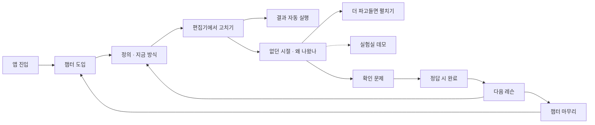

# React Lab PRD — 리액트 학습용 웹 앱

2026-09-21 · 작성 @Someone

## 배경

React Lab은 자바스크립트를 막 배운 사람이 리액트를 처음부터 배우는 학습용 웹 앱이다. 리액트가 무엇인지 모르는 상태에서 시작해, 개념을 익히고 바로 손으로 실습하고, 그 개념이 왜 생겼는지까지 내려간다. 설치 없이 브라우저에서 열린다.

읽는 사람은 리액트를 아예 모른다고 전제한다. `map`, 구조 분해, 스프레드 같은 문법은 배웠지만 손에 익지 않았고, 프레임워크를 써 본 적이 없다. 그래서 "왜 굳이 리액트인가"부터 설명해야 한다.

기존 자료는 이 사람에게 셋 중 하나가 빠져 있다. 문서는 개념을 설명하지만 화면에서 어떻게 움직이는지 보여주지 못한다. 플레이그라운드는 코드를 돌려주지만 왜 그렇게 되는지 알려주지 않는다. 둘 다 이 API가 무엇을 해결하려고 나왔는지는 말하지 않는다.

마지막 빈칸이 채워지면 개념이 오래 남고, 기술 면접에서 깊게 파고들어도 자기 말로 설명할 수 있게 된다. 면접 대비는 별도 목표가 아니라 개념·실습·배경 세 가지를 갖춘 결과다.

## 문제와 목표

JS만 배운 사람이 리액트에서 막히는 지점은 두 군데다. 먼저 '화면을 왜 함수로 만드는가'라는 발상 자체가 낯설다. 그다음은 실행 모델이다. 언제 다시 그려지는지, state가 왜 즉시 안 바뀌는지, key가 왜 필요한지를 설명만으로는 잡기 어렵다.

제품 목표는 네 가지다.

1. 리액트를 모르는 상태에서 시작해 개념을 순서대로 익힌다. 리액트가 대신해 주는 일이 무엇인지부터 다룬다.
2. 할 일 목록 앱 하나를 챕터마다 키워 간다. 다음 레슨을 여는 이유가 '내 앱에 아직 저게 없어서'가 되게 한다. 설명하기 어려운 동작(리렌더링 전파, state와 ref 차이, key 오사용)은 화면에서 직접 보게 한다.
3. 먼저 손으로 써 보고, 그다음에 이 개념이 무엇을 해결하려고 나왔는지로 내려간다. 여기까지 가면 사용법을 넘어 자기 말로 설명할 수 있고, 면접 대비는 따로 하지 않아도 따라온다.
4. 환경 설정을 요구하지 않는다. 링크를 열면 바로 코드가 돌아간다.

## 사용자

사용자는 본인 한 명이다. 다만 시기에 따라 두 상태로 쓴다.

| 시기 | 상황 | 이 앱에서 하는 일 |
| --- | --- | --- |
| 지금 (입문자) | JS는 배웠고 리액트는 처음. 왜 필요한지도 모른다 | 챕터 0부터 순서대로 읽고, 예제를 고치고, 확인 문제로 넘어간다 |
| 나중 (면접 준비) | 한 바퀴 돌았지만 왜 그런지 물으면 막힌다 | 해당 레슨의 '없던 시절'과 '더 파고들면'만 펼쳐 본다 |

본문의 눈높이는 입문자 시기에 맞춘다. 깊은 내용은 접힌 블록에 두어 나중에 펼친다. 혼자 쓰는 앱이므로 온보딩이나 설명 문구를 따로 만들지 않고, 읽다가 걸리는 부분은 그때그때 고친다.

## 범위

포함:

- 시작 챕터 레슨 2개: 리액트가 대신해 주는 일, 이 앱에서 쓰는 JS 문법 점검
- react.dev Learn의 4개 챕터(UI 표현하기, 상호작용 더하기, state 관리하기, 탈출구)를 모두 덮는 레슨 30개
- 성능과 React 19 이후 API를 다루는 챕터 1개, 레슨 7개
- 챕터 1\~4를 관통하는 할 일 목록 예제. 실습 레슨마다 편집 가능한 코드와 실시간 실행 결과, 개념 레슨은 읽기 전용 코드와 그림
- 동작 시각화 데모 3종. 관련 레슨 본문에서 바로 열린다
- 레슨당 객관식 확인 문제 1개
- 챕터 도입·마무리 문단과 챕터·레슨 단위 진행도 저장

제외:

- 로그인, 서버, 계정 간 동기화
- 빌드 도구·라우팅·데이터 패칭 라이브러리를 다루는 레슨. 앱 자체는 Vite로 만들지만 커리큘럼에는 넣지 않는다
- 서버 컴포넌트와 서버 함수 실습. 브라우저 단독 환경에서 실행할 수 없으므로 개념 설명과 그림만 둔다. 데모 페이지는 v1 이후에 검토한다
- 타입스크립트 (v1은 JS만)
- 코드 채점, 자동 정답 판정
- 다국어 (한국어만)

## 커리큘럼

챕터 0은 이 앱이 더한 것이고, 챕터 1\~4는 [react.dev Learn](https://react.dev/learn)의 장 구성을 그대로 따른다. 순서가 곧 학습 경로이므로 임의로 재배열하지 않는다. 형태가 '개념'인 레슨은 편집기 대신 읽기 전용 코드와 그림을 쓴다. 이유는 레슨마다 다르다. 4는 샌드박스가 import를 못 받아서, 13은 내부 동작이라 눈으로 보는 쪽이 나아서, 38과 39는 브라우저 단독으로 실행할 수 없어서다.

| 챕터 | # | 레슨 | 형태 |
| --- | --- | --- | --- |
| 0. 시작하기 전에 | 1 | 리액트가 대신해 주는 일 | 실습 |
|  | 2 | 이 앱에서 쓰는 JS 문법 점검 | 실습 |
| 1. UI 표현하기 | 3 | 첫 번째 컴포넌트 | 실습 |
|  | 4 | 컴포넌트 import와 export | 개념 |
|  | 5 | JSX로 마크업 작성하기 | 실습 |
|  | 6 | 중괄호로 JSX 안에서 JavaScript 쓰기 | 실습 |
|  | 7 | props로 데이터 전달하기 | 실습 |
|  | 8 | 조건부 렌더링 | 실습 |
|  | 9 | 리스트 렌더링 | 실습 |
|  | 10 | 컴포넌트를 순수하게 유지하기 | 실습 |
| 2. 상호작용 더하기 | 11 | 이벤트에 응답하기 | 실습 |
|  | 12 | state: 컴포넌트의 기억 | 실습 |
|  | 13 | 렌더링과 커밋 | 개념 |
|  | 14 | 스냅샷으로서의 state | 실습 |
|  | 15 | state 업데이트 큐 | 실습 |
|  | 16 | 객체 state 업데이트하기 | 실습 |
|  | 17 | 배열 state 업데이트하기 | 실습 |
| 3. state 관리하기 | 18 | state로 입력에 반응하기 | 실습 |
|  | 19 | state 구조 선택하기 | 실습 |
|  | 20 | 컴포넌트 간 state 공유하기 | 실습 |
|  | 21 | state 보존과 초기화 | 실습 |
|  | 22 | reducer로 state 로직 추출하기 | 실습 |
|  | 23 | Context로 데이터 깊게 전달하기 | 실습 |
|  | 24 | reducer와 Context로 확장하기 | 실습 |
| 4. 탈출구 | 25 | ref로 값 참조하기 | 실습 |
|  | 26 | ref로 DOM 조작하기 | 실습 |
|  | 27 | Effect로 동기화하기 | 실습 |
|  | 28 | Effect가 필요 없는 경우 | 실습 |
|  | 29 | 반응형 Effect의 생명주기 | 실습 |
|  | 30 | Effect에서 이벤트 분리하기 | 실습 |
|  | 31 | Effect 의존성 제거하기 | 실습 |
|  | 32 | 커스텀 훅으로 로직 재사용하기 | 실습 |
| 5. 성능과 최신 React | 33 | 다시 그리기 줄이기: memo·useMemo·useCallback | 실습 |
|  | 34 | ref를 prop으로 받기 | 실습 |
|  | 35 | Action과 useActionState | 실습 |
|  | 36 | useOptimistic으로 낙관적 UI | 실습 |
|  | 37 | use로 값과 Context 읽기 | 실습 |
|  | 38 | React Compiler가 대신 해주는 일 | 개념 |
|  | 39 | 서버 컴포넌트가 푸는 문제 | 개념 |

챕터 0에서 리액트가 왜 필요한지와 앞으로 쓸 JS 문법을 확인한다. 1\~2를 마치면 화면을 그리고 이벤트에 반응시킬 수 있고, 3을 마치면 상태 구조를 설계할 수 있다. 4는 리액트 바깥과 이어 붙이는 방법이다. 5는 33에서 다시 그리기를 손으로 줄여 본 다음, 최근 버전이 그 수고를 어떻게 덜어 갔는지로 이어진다.

레슨별 본문은 react.dev의 설명을 옮기지 않는다. 아래 '레슨 본문 구조'에 맞춰, 할 일 목록 예제를 한 단계씩 키우는 흐름으로 새로 쓴다.

## 레슨 본문 구조

블록 순서는 손이 먼저, 배경이 나중이다. 리액트를 처음 보는 사람에게 옛날 코드를 먼저 보여줘도 비교할 대상이 없다. 직접 고쳐본 다음에 "그런데 이게 왜 생겼냐면"으로 이어져야 배경이 읽힌다.

앞의 세 블록(정의·지금 방식·확인 문제)은 모든 레슨에 있고, 뒤의 세 블록은 있을 때만 붙인다. 다섯 칸을 억지로 채우지 않는다. 개념 레슨(4, 13, 38, 39)은 '지금 방식'이 편집기 대신 읽기 전용 코드나 그림이 된다. 4 'import와 export'는 샌드박스가 import를 지원하지 않아 파일 두 개를 나란히 보여주고, 13 '렌더링과 커밋'은 실험실의 리렌더링 데모로 이어진다. 레슨 2 'JS 문법 점검'만 예외로, 문법 항목마다 짧게 반복하는 체크리스트 형식이다.

JS 되짚기는 이 레슨이 기대는 문법을 한 줄씩 짚는 칸이다. 예를 들어 9 '리스트 렌더링'은 `map`이 새 배열을 돌려준다는 것, 17 '배열 state'는 스프레드가 얕은 복사라는 것을 먼저 확인시킨다. 리액트를 설명하다 말고 JS를 설명하는 일이 없도록 앞에 뺀 것이다.

| 블록 | 내용 | 언제 |
| --- | --- | --- |
| JS 되짚기 | 이 레슨이 기대는 문법을 한 줄씩 | 필요한 레슨만 |
| 한 줄 정의 | 이 개념이 무엇인지 한 문장 | 항상 |
| 지금 방식 | 편집기에 올라가는 예제. 직접 고쳐 실행한다 | 항상 |
| 없던 시절 | 이게 없을 때 같은 일을 어떻게 했는지. 읽기 전용 코드 | 비교할 과거가 있을 때만 |
| 왜 나왔나 | 무엇을 해결하려고 나왔는지, 이전 방식이 왜 한계였는지 | 없던 시절이 있을 때 |
| 더 파고들면 | 한 단계 더 들어올 때 나오는 질문과 흔한 오해 2\~3개 | 접힌 채로, 있을 때만 |

'없던 시절'과 '왜 나왔나'는 아래 배경 표에 정리된 13개 개념이 있는 레슨에만 붙는다. JSX 중괄호나 이벤트 처리처럼 비교할 과거가 없는 개념에 억지로 만들어 붙이면 어색한 문단이 된다. 드물게 나와야 나왔을 때 반갑다.

'없던 시절'의 코드는 실행하지 않는다. 바로 위 편집기의 예제와 같은 문제를 풀어야 하고, 한쪽만 고치면 대비가 깨지므로 레슨 검수 항목에 넣는다.

'더 파고들면'은 정답을 외우게 하는 칸이 아니다. 질문과 함께 답의 근거가 되는 동작을 적고, 가능하면 실험실 데모나 다른 레슨으로 연결한다.

### 개념별 배경 정리

'없던 시절'과 '왜 나왔나' 블록이 실제로 담을 내용이다. 본문을 쓸 때 이 표를 출발점으로 삼는다. 표의 문장 자체도 본문과 같은 눈높이로 쓴다. 용어로 압축하지 않고, 그때 사람들이 실제로 무엇을 하고 있었는지를 적는다.

| 개념 | 그전에는 이렇게 했다 | 그래서 불편했다 | 더 파고들면 |
| --- | --- | --- | --- |
| 리액트 자체 | 버튼을 누르면 document.querySelector로 요소를 찾아 내용을 직접 바꿨다 | 화면이 커질수록 어디서 무엇을 바꿨는지 추적이 안 됐고, 데이터와 화면이 서로 어긋났다 | DOM을 직접 만지지 않게 해 준 대가로 리액트가 가져간 것은 무엇인가 |
| JSX | 화면에 그릴 태그를 `React.createElement('div', null, '안녕')` 같은 함수 호출로 하나씩 적었다 | 코드만 봐서는 화면이 어떻게 생겼는지 안 보였다 | JSX는 결국 저 함수 호출로 바뀐다. 무엇으로 바뀌는지 말할 수 있어야 한다 |
| 함수 컴포넌트 | 화면 한 조각을 만들려고 class를 만들고, 메서드마다 `this`가 무엇을 가리키는지 챙겼다 | 생성자에서 bind를 빠뜨리면 클릭이 그냥 터졌다. 배울 게 화면 그리기와 상관없는 것들이었다 | class가 금지된 건 아니다. 오류 경계는 지금도 class로만 만든다 |
| Hooks | 창 크기 구독처럼 같은 로직을 여러 컴포넌트에서 쓰려면, 컴포넌트를 감싸는 컴포넌트를 따로 만들어 끼웠다 | 감싸는 층이 겹겹이 쌓여 트리가 깊어졌다. 로직만 떼어 가져갈 방법이 없었다 | 훅을 `if` 안에서 못 쓰는 이유는 호출 순서로 어떤 state인지 알아내기 때문이다 |
| 불변 업데이트 | 가지고 있던 배열이나 객체를 `items.push(...)`처럼 직접 고쳤다 | 리액트가 무엇이 바뀌었는지 알 방법이 없어 화면이 그대로였다 | 비교는 얕게만 한다. 같은 배열을 고쳐 넘기면 왜 안 그려지는지 |
| key | 목록에서 몇 번째인지(index)로 항목을 구분했다 | 중간에 하나를 넣거나 지우면 입력값과 포커스가 엉뚱한 줄에 남았다 | key는 속도를 위한 힌트가 아니라 '이건 아까 그 항목'이라고 알려주는 이름표다 |
| useEffect | 화면에 붙을 때, 값이 바뀔 때, 떼어질 때 세 군데에 코드를 나눠 적었다 | 연결하고 끊기처럼 원래 한 덩어리인 일이 세 곳에 흩어져, 한 곳만 고치고 나머지를 빠뜨렸다 | cleanup이 왜 필요한지, 의존성 배열에서 값을 빼면 무엇이 깨지는지 |
| useReducer | 버튼마다 `setState`를 흩어 놓았다 | 상태가 어떤 순서로 바뀌는지 알려면 컴포넌트 전체를 뒤져야 했다 | Redux와의 관계, 그리고 useState로 충분한 선은 어디인지 |
| Context | 정작 쓰지도 않는 중간 컴포넌트에 props를 계속 넘겨줬다 | 값 하나 내려보내려고 거쳐 가는 컴포넌트를 전부 고쳐야 했다 | Context는 상태 관리 도구가 아니다. 값이 바뀌면 쓰는 쪽이 전부 다시 그려진다 |
| ref를 prop으로 (19) | 자식의 입력창을 직접 만지려면 그 컴포넌트를 `forwardRef`로 감쌌다 | 컴포넌트마다 똑같은 껍데기 코드가 붙었다 | ref는 왜 그동안 다른 prop과 달리 취급됐는가 |
| useActionState · useOptimistic (19) | 폼을 낼 때마다 제출 중인지, 실패했는지, 되돌려야 하는지를 직접 만들어 관리했다 | 폼마다 같은 코드를 다시 썼고, 되돌리는 처리를 자주 빠뜨렸다 | 낙관적으로 먼저 보여준 화면은 실패하면 무엇이 되돌아가는가 |
| React Compiler | 화면이 느려지면 `memo`, `useMemo`, `useCallback`을 사람이 찾아 붙였다 | 어디에 붙여야 할지 판단하기 어렵고, 붙이고도 효과를 확인하기 힘들었다 | 컴파일러가 있어도 손으로 붙여야 하는 경우가 남는다 |
| 서버 컴포넌트 | 모든 컴포넌트를 브라우저로 내려보내고, 화면이 뜬 뒤 데이터를 다시 요청했다 | 내려받을 코드가 계속 커지고, 요청이 끝나야 다음 요청이 시작됐다 | 서버에서 클라이언트로 넘기는 값은 JSON으로 바꿀 수 있어야 한다 |

### 쓰기 원칙

깊게 설명하는 것과 어렵게 설명하는 것은 다르다. 배경을 넣는다고 본문이 논문이 되면 입문자는 첫 챕터에서 덮는다.

- 리액트보다 JS가 먼저 막힌다. 레슨이 기대는 문법은 첫머리 'JS 되짚기'에서 한 줄씩 확인하고, 본문 중간에 JS 설명을 끼워 넣지 않는다.
- 상황부터 말하고 용어는 나중에 붙인다. "로직 재사용이 어려웠다"가 아니라 "같은 구독 코드를 컴포넌트 다섯 개에 복사해 두고 있었다".
- 새 용어는 처음 나올 때 한 줄로 푼다. 재조정, 메모이제이션, 직렬화처럼 아는 척 넘어가기 쉬운 말이 대상이다.
- 한 문단 3문장 안쪽, 한 문장에 생각 하나. 쉼표로 이어 붙이지 않는다.
- 비유는 레슨당 하나까지. 비유로 끝내지 않고 반드시 코드로 돌아온다.
- 공식 문서 문장을 옮기지 않는다. 읽고 덮은 다음 다시 쓴다.
- '간단히', '그냥', '당연히'를 쓰지 않는다. 읽는 사람에게는 당연하지 않다.

'더 파고들면' 블록은 접힌 상태로 시작한다. 처음 읽는 사람은 넘어가고, 면접을 준비하는 사람만 펼친다. 같은 본문이 두 난이도를 감당하는 방법이다.

아래는 Effect 레슨의 '왜 나왔나' 블록이 지향하는 밀도다.

```markdown
class를 쓰던 시절에는 화면에 붙었을 때, 값이 바뀌었을 때, 떼어질 때
세 군데에 코드를 나눠 적었다. 채팅방에 연결하는 일처럼 원래 한 덩어리인
작업도 세 곳에 흩어졌고, 한 곳만 고치고 나머지를 빠뜨리기 쉬웠다.

useEffect는 시점을 세는 대신 한 가지 일로 묶는다. 이 컴포넌트가 화면에
있는 동안 바깥 시스템을 이 상태에 맞춰둔다는 것이다. 연결을 여는 코드와
닫는 코드가 한 함수 안에 붙어 있어서, 방을 바꾸면 이전 연결이 먼저 닫힌다.
```

레슨 검수는 두 사람 기준으로 본다. 리액트를 처음 보는 사람이 막히지 않고 끝까지 읽는가, 그리고 이미 아는 사람이 새로 알게 된 것이 하나라도 있는가.

### 하나의 앱이 자란다

레슨마다 다른 예제를 쓰지 않는다. 챕터 1부터 4까지는 **할 일 목록 하나**를 계속 키워 간다. 다음 레슨을 여는 이유가 '다음 항목이라서'가 아니라 '내 앱에 아직 저게 없어서'가 되게 만드는 장치다.

| 챕터 | 앱이 이렇게 자란다 |
| --- | --- |
| 1. UI 표현하기 | 할 일 카드 한 장을 그린다. 제목과 완료 여부가 props로 들어오고, 목록으로 늘어난다 |
| 2. 상호작용 더하기 | 체크박스가 눌리고, 새 할 일이 추가된다. 화면이 움직이기 시작한다 |
| 3. state 관리하기 | 전체·남은 것·끝낸 것 필터가 붙고, 상태가 어디에 있어야 하는지 정리한다 |
| 4. 탈출구 | 새로고침해도 남도록 저장하고, 입력창에 자동으로 커서가 간다 |
| 5. 성능과 최신 React | 목록이 길어졌을 때 다시 그리기를 줄이고, 최근 API로 같은 코드를 다시 쓴다 |

레슨의 편집기는 그 시점까지 자란 앱을 담는다. 이전 레슨에서 만든 코드가 그대로 이어지므로, 배운 것이 사라지지 않고 쌓인다. 다만 레슨마다 초기 코드는 고정이다. 앞 레슨에서 사용자가 고친 내용을 물려받지 않는다. 한 레슨을 건너뛰어도 다음 레슨이 깨지지 않아야 하기 때문이다.

챕터 0과 5는 예외다. 0은 리액트 자체를 소개하는 자리라 더 작은 예제를 쓰고, 5는 앞에서 만든 할 일 목록을 재료로 쓰되 API마다 필요한 부분만 떼어 본다.

### 챕터 도입과 마무리

챕터를 열면 두세 문장짜리 도입이 먼저 나온다. 지금까지 만든 것과 아직 안 되는 것을 짚어 다음 챕터의 이유를 만든다.

```markdown
지금까지 할 일 목록을 화면에 그렸다. 그런데 체크박스를 눌러도
아무 일도 일어나지 않는다. 화면은 데이터를 보여줄 뿐,
데이터가 바뀌는 방법을 아직 모르기 때문이다.

이번 챕터에서는 리액트가 변화를 어떻게 다루는지 본다.
```

챕터 끝에는 한 문단짜리 마무리를 둔다. 만든 것을 한 줄로 정리하고, 다음 챕터에서 풀 문제를 미리 하나 남긴다. 목록에서 챕터를 접었을 때 이 도입 문장이 한 줄 요약으로 보인다.

## 핵심 기능

### 1. 레슨

왼쪽 목록은 챕터 6개로 접히고, 접힌 상태에서는 챕터 도입 문장이 한 줄 요약으로 보인다. 챕터를 처음 열면 도입 문단이 먼저 나오고, 마지막 레슨을 끝내면 마무리 문단이 나온다.

레슨을 열면 위에서부터 JS 되짚기, 한 줄 정의, 지금 방식(편집기와 결과 패널), 없던 시절(읽기 전용 코드), 왜 나왔나, 접힌 '더 파고들면', 확인 문제 순서다. 뒤의 세 블록은 있는 레슨에만 나온다. 편집기 위에는 이 레슨에서 앱에 무엇이 더해지는지 한 줄로 적는다. 연결된 실험실 데모가 있으면 본문 안에 바로 여는 링크를 둔다. 이전/다음 버튼은 챕터 경계를 넘어 39개를 한 줄로 잇는다.

### 2. 라이브 코드

각 레슨의 예제는 편집 가능하다. 입력이 멈추고 600ms 뒤 자동으로 다시 실행되고, 결과는 오른쪽(모바일은 아래) 패널에 렌더링된다. 컴파일 오류와 렌더링 오류는 결과 패널에 메시지로 표시되고, 직전 정상 화면은 지운다. 레슨별 '원래 코드로' 버튼으로 초기 예제를 복원한다.

### 3. 실험실

코드가 아니라 동작을 보여주는 데모 3종이다.

| 데모 | 보여주는 것 | 조작 |
| --- | --- | --- |
| 리렌더링 전파 | 부모 state 변경 시 다시 그려지는 자식이 깜빡인다. 컴포넌트별 렌더 횟수 표시 | 카운트 증가, memo 켜기/끄기 |
| state와 ref | useState는 화면을 갱신하고 useRef는 값만 바꾼다 | 각각 증가, 강제 렌더 |
| key의 영향 | 같은 목록을 index key와 id key로 나란히 렌더. 앞에 항목을 넣으면 index 쪽 입력값이 밀린다 | 입력 후 맨 앞에 추가 |

### 4. 확인 문제

레슨 끝에 3지선다 1문제. 답을 고르면 정답 여부와 한 줄 해설이 나오고, 정답이면 해당 레슨이 완료로 표시된다. 오답은 다시 고를 수 있다.

### 5. 진행도

헤더에 전체 진행률을, 목록에는 챕터별 완료 수(예: 5/8)를 표시한다. 저장은 브라우저 로컬이며, 초기화 버튼을 둔다. 레슨이 39개라 한 번에 끝나지 않는 것을 전제로, 재진입 시 마지막 레슨으로 돌아간다.

### 6. 플레이그라운드

레슨과 분리된 빈 편집기. 마지막 코드가 로컬에 저장되어 다시 열면 이어진다.

## 화면 구조

단일 페이지에 상단 탭 3개(레슨 / 실험실 / 플레이그라운드)를 둔다. 레슨 탭만 좌측에 챕터별로 접히는 목록 레일을 갖는다. 768px 미만에서는 레일이 사라지고 본문 위에 '챕터 · 레슨 제목' 버튼이 남아, 누르면 목록이 드로어로 열린다. 이전 코드·편집기·결과 패널은 세로로 쌓인다. 실험실은 별도 탭이지만 레슨 본문에서 해당 데모로 바로 여는 링크가 있어, 읽던 자리에서 동작을 확인하고 돌아올 수 있다.



진입 시 마지막으로 보던 레슨을 복원한다. 기록이 없으면 1번 레슨으로 연다.

## 기술 구조

Vite로 만들고 빌드 결과를 GitHub Pages 같은 정적 호스팅에 올린다. 서버는 없다. 레슨 데이터는 `src/lessons/` 폴더에 챕터별 모듈로 나눠 두어, 본문을 고칠 때 앱 코드를 건드리지 않는다. 커리큘럼에서 빌드 도구를 가르치지 않는 것과 앱을 Vite로 만드는 것은 별개다. 배우는 사람은 링크만 연다.

| 요소 | 선택 | 이유 |
| --- | --- | --- |
| 빌드 | Vite | 앱 코드의 JSX 컴파일, 파일 분리, 정적 호스팅용 빌드 |
| UI 런타임 | React 19 (npm) | `use`, `useActionState`, `useOptimistic` 레슨에 19가 필요하다 |
| 사용자 코드 변환 | @babel/standalone (npm, 지연 로드) | 편집기에 친 JSX를 브라우저에서 실시간 변환. 빌드 도구로 대체할 수 없다 |
| 스타일 | 단일 CSS, 변수 기반 라이트/다크 | 외부 프레임워크 없음 |
| 저장소 | localStorage | 계정 없이 기기별 보존 |
| 폰트 | IBM Plex Sans KR / IBM Plex Mono | 한글 본문과 코드 슬래브 대비 |

React 19에는 UMD 빌드가 없지만 npm으로 설치하므로 상관없다. Babel Standalone은 사용자가 편집기에 쓰는 코드를 실시간으로 변환하는 데만 쓰고, 용량이 크므로 별도 청크로 나눠 편집기가 처음 보일 때 불러온다.

사용자 코드 실행 경로는 이렇다.

1. 편집기 값이 바뀌면 600ms 디바운스 후 `Babel.transform(code, { presets: ['react'] })`으로 변환한다.
2. 변환 결과를 `new Function`으로 감싸 실행하고, 마지막에 `App` 컴포넌트를 반환받는다. `React`와 훅들은 인자로 주입하므로 사용자 코드에 import가 없어도 된다.
3. 결과 패널 전용 루트에 오류 경계로 감싼 `App`을 렌더한다. 코드가 바뀌면 `key`를 갈아 오류 상태를 초기화한다.

레슨 35\~37은 `useActionState`, `useOptimistic`, `use`를 쓴다. 주입 목록에 React 19 훅을 함께 넣어야 하고, `use`는 Suspense 경계 안에서만 의미가 있으므로 결과 패널이 기본으로 Suspense를 감싼다.

제약: 사용자 코드는 `App`이라는 이름의 컴포넌트를 정의해야 한다. import는 지원하지 않으며 필요한 훅은 전역처럼 바로 쓴다. 이 규칙은 편집기 상단에 한 줄로 고지한다.

## 데이터 모델

레슨은 `src/lessons/` 폴더의 챕터별 모듈에 배열로 둔다. 별도 CMS나 API는 없다.

```csv
필드,타입,설명
id,string,레슨 식별자이자 진행도 저장 키
chapter,string,소속 챕터 id. 목록 그룹과 진행률 집계 기준
order,number,전체 순서. 이전/다음 이동에 사용
title,string,목록과 본문 제목
tagline,string,목록에 보이는 한 줄 설명
kind,enum,practice · concept · checklist
jsPrereq,string[],JS 되짚기. 없으면 생략
definition,string,한 줄 정의. 필수
starterCode,string,지금 방식의 편집기 초기 코드. 필수. 앞 레슨까지 자란 할 일 목록을 담는다
goal,string,이 레슨에서 앱에 무엇이 더해지는지 한 줄
before,object,없던 시절 블록. 설명과 실행하지 않는 코드. 배경이 있는 레슨만
why,string[],왜 나왔나 블록. before가 있을 때만
deeper,object[],더 파고들면 블록. 접힌 상태. 없으면 생략
items,object[],checklist 전용
demo,string,연결할 실험실 데모 id
sources,string[],배경 설명의 근거 링크
quiz,object,question·options·answerIndex·explanation
```

챕터는 별도 상수로 둔다. id, 제목, 도입 문단, 마무리 문단, 소속 레슨 순서를 갖는다.

`before.code`와 `starterCode`는 같은 문제를 푸는 짝이어야 한다. 한쪽만 고치면 대비가 깨지므로 레슨 검수 항목에 넣는다.

localStorage 키는 셋이다.

| 키 | 값 | 용도 |
| --- | --- | --- |
| `reactlab:progress:v1` | 완료 레슨 id 배열 | 진행도 |
| `reactlab:last:v1` | 레슨 id와 탭 이름 | 재진입 복원 |
| `reactlab:playground:v1` | 코드 문자열 | 플레이그라운드 초안 |

버전 접미사를 두어 스키마가 바뀌면 이전 키를 무시한다. 읽기와 쓰기는 모두 실패를 허용한다. 저장이 막힌 브라우저에서도 앱은 그대로 동작하고 진행도만 남지 않는다.

## 비기능 요구사항

- 첫 화면이 보이기까지 3초 이내(일반 회선 기준). Babel 청크를 받는 동안 편집기는 비활성 상태로 표시하고, 본문은 먼저 읽을 수 있어야 한다.
- 코드 재실행은 입력 후 600ms 디바운스. 실행 중 화면 멈춤이 느껴지지 않아야 한다.
- 무한 루프 코드는 탭을 멈출 수 있다. v1은 막지 않고, 편집기 옆에 주의 문구만 둔다.
- 360px 폭까지 가로 스크롤 없이 동작한다.
- 키보드로 탭 전환, 레슨 이동, 보기 선택이 가능하고 포커스 링이 보인다.
- 라이트/다크 모두 본문 대비 4.5:1 이상.
- `prefers-reduced-motion`이 켜져 있으면 깜빡임 애니메이션 대신 렌더 횟수 숫자 변화로만 표시한다.
- 오류 문구는 무엇이 잘못됐고 무엇을 고치면 되는지를 쓴다. 사과하지 않는다.

## 성공 지표

혼자 쓰는 앱이라 분석 도구도 사용자 조사도 없다. 지표는 전부 자기 점검이다.

- 챕터 0을 읽고 '리액트가 왜 필요한가'를 한 문장으로 말할 수 있다.
- 한 레슨을 읽고 예제를 고쳐 확인 문제까지 푸는 데 평균 12분 이내. 39개 전체는 8시간 안쪽.
- key 데모를 본 뒤 index key 문제를 코드 없이 설명할 수 있다.
- 챕터 4까지 마친 뒤 '왜 훅이 나왔나', 'Effect는 생명주기와 무엇이 다른가'를 자기 말로 답할 수 있다. 깊이의 지표이자 면접 대비의 지표다.
- 실습 레슨 35개의 예제가 모두 수정 없이 실행되고, 대표 오류 3종(문법 오류, App 미정의, 렌더 중 예외)이 화면에 메시지로 잡힌다.
- 한 챕터를 끝낸 뒤 다음 챕터를 열기까지 일주일을 넘기지 않는다. 넘어가면 해당 챕터의 분량이나 난이도를 의심한다.
- 챕터 4를 끝냈을 때 손에 남는 것이 '레슨 32개'가 아니라 '내가 만든 할 일 앱'이다.

## 마일스톤

| 단계 | 범위 | 완료 기준 |
| --- | --- | --- |
| M1 | Vite 프로젝트 + 코드 실행 엔진 + 플레이그라운드 + Pages 배포 | 배포된 링크에서 임의의 JSX를 입력해 렌더하고 오류를 표시한다 |
| M2 | 레슨 골격 + 챕터 0\~2 (레슨 1\~17) + 실험실 데모 3종 | 챕터 접기, 이전/다음, 다섯 블록 본문과 확인 문제가 동작하고, 레슨 9·13에서 데모로 넘어간다 |
| M3 | 챕터 3\~4 (레슨 18\~32) | 32개 레슨이 채워지고 진행도가 챕터별로 집계된다 |
| M4 | 챕터 5 (레슨 33\~39) | memo 레슨이 실험실 데모와 이어지고, React 19 API 예제가 실행된다 |
| M5 | 다듬기 | 반응형, 접근성, 오류 문구, 라이트/다크 점검 |

M1이 가장 불확실하므로 먼저 만든다. 여기서 막히면 나머지 설계가 흔들린다. 실험실 데모는 레슨 9(key)와 13(렌더링)이 기대므로 챕터 5보다 앞서 M2에 함께 만든다. 레슨 본문이 다섯 블록으로 늘어나 집필이 최대 작업량이므로 M2\~M4에 나눠 싣고, 각 단계마다 그때까지의 레슨만으로도 쓸 수 있는 상태를 유지한다.

## 리스크와 이후 검토

| 항목 | 영향 | 대응 |
| --- | --- | --- |
| 레슨 39개가 한 예제로 이어져 본문 작성이 최대 병목 | 일정 지연 | 챕터 단위로 나눠 출시, 미완성 챕터는 목록에서 잠금 표시. 챕터별 최종 코드를 먼저 확정하고 레슨을 역산해 쓴다 |
| 사용자 코드가 앱과 다른 React 인스턴스를 잡으면 훅이 깨진다 | 실행 엔진 오동작 | `new Function`에 앱이 쓰는 React 객체를 직접 주입하고 M1에서 먼저 확인 |
| Babel 청크 용량으로 편집기 준비가 늦어짐 | 이탈 | 본문을 먼저 그리고 편집기는 로딩 표시. 청크는 레슨 탭 진입 시 미리 받기 시작 |
| 사용자 코드의 무한 루프가 탭을 멈춤 | 작업 손실 | v1은 주의 문구, 이후 Web Worker 격리 검토 |
| 편집기가 textarea라 하이라이트·자동완성 없음 | 학습 경험 저하 | v1 감수, 이후 경량 에디터 도입 검토 |
| 배경 설명이 부정확하면 면접에서 역효과 | 신뢰 손상 | 공식 문서·RFC·릴리스 노트로 근거를 확인하고 레슨마다 출처 링크를 단다 |
| 예제가 이어지다 보니 한 레슨을 고치면 뒤쪽 starterCode가 줄줄이 틀어진다 | 유지보수 부담 | 챕터별 최종 코드를 기준 파일로 두고 각 레슨은 거기서 잘라 쓴다. 레슨마다 초기 코드는 고정이라 사용자 수정은 전파되지 않는다 |

v1 이후 검토:

- 서버 컴포넌트(레슨 39) 데모 페이지. 개념 설명만으로 부족하다고 느껴질 때
- 사용자 코드 Web Worker 격리. 무한 루프가 실제로 문제가 될 때
- 경량 코드 에디터 도입. textarea가 학습을 방해한다고 느껴질 때
